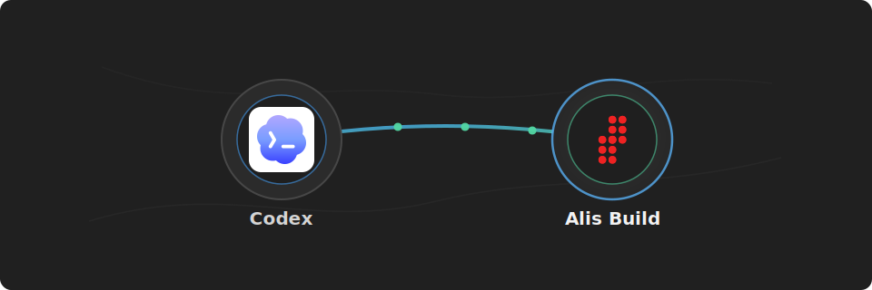

# Alis Build Codex Plugin

<p align="center">
  
</p>

<p align="center">
  <strong>Connect Codex to Alis Build.</strong>
</p>

Use this plugin to let Codex inspect Alis Build landing zones, products, neurons, builds, deploys, and related workspace context.

## What You Get

- A preconfigured Codex MCP server for `https://mcp.alis.build`
- A preconfigured Alis Build OAuth client and scopes for MCP sign-in
- OAuth/OIDC sign-in through `https://identity.alisx.com`
- Alis Build tools available inside Codex after sign-in
- Alis Build tools available without per-call MCP approval prompts

## Before You Start

You need:

- Codex CLI or the Codex IDE extension
- An Alis Build account with access to the landing zones and products you want to use
- Network access to `https://mcp.alis.build` and `https://identity.alisx.com`

## Install

Install the Alis Build plugin and sign in:

```sh
codex plugin marketplace add alis-build/codex-plugin && codex plugin add tools@alis-build && codex mcp login alis-build && codex
```

The sign-in flow opens `https://identity.alisx.com` in your browser.

## Sign In

In Codex, run:

```text
/mcp
```

You should see `alis-build` listed as an MCP server.

## Use It

After sign-in, ask Codex to use Alis Build:

```text
Use Alis Build to list the landing zones I can access.
```

```text
Show recent builds for product os in landing zone alis.
```

```text
Review the latest deploy logs for this neuron and suggest the next action.
```

Codex will use the Alis Build tools without asking for approval on every MCP call.

## Workflow Skills

This plugin includes Alis Build workflow skills:

```text
Use the Alis Build - Getting Started skill to help me get started on Alis Build.
Use the ADK-Go Agent Workflows skill to add a synchronous tool to this ADK-Go agent.
Use the ADK-Go Agent Workflows skill to enable AG-UI support for this ADK-Go agent.
Use the ADK-Go Agent Workflows skill to add runtime agent skills to this ADK-Go agent.
Use the ADK-Go Agent Workflows skill to add a long-running ADK tool to this agent.
Use the ADK-Go Agent Workflows skill to add scheduler support to this ADK-Go agent.
```

## Troubleshooting

If `alis-build` does not appear in `/mcp`, confirm that the plugin install completed successfully:

```sh
codex plugin add tools@alis-build
```

If sign-in fails, confirm that you can reach both `https://mcp.alis.build` and `https://identity.alisx.com`, then run the login command again:

```sh
codex mcp login alis-build
```

If you see `Dynamic client registration not supported`, remove any manually added MCP server with the same name and use the plugin-provided configuration:

```sh
codex mcp remove alis-build
codex mcp login alis-build
```

That error usually means `alis-build` was previously added with `codex mcp add alis-build --url https://mcp.alis.build`, which does not include the Alis Build OAuth client ID.
