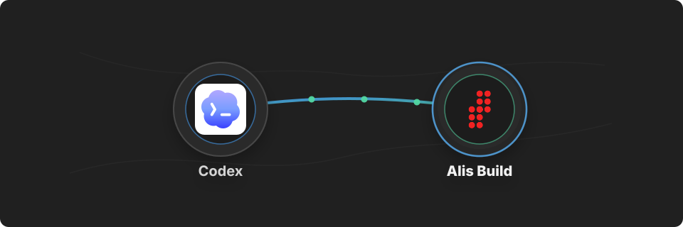

# Alis Build Codex Plugin

<p align="center">
  
</p>

<p align="center">
  <strong>Connect Codex to Alis Build.</strong>
</p>

Use this plugin to let Codex work with Alis Build organisations, products, neurons, builds, and deploys through the `alis` CLI, with workspace-aware context injected into every session.

## What You Get

- A standing Define → Build → Deploy primer loaded into every session
- Native skill discovery: a `discover` skill that finds and loads the right Alis Build skill from the registry on your own words, and a `capture` skill that saves just-completed work as a reusable team skill
- Ambient per-prompt skill suggestions inside Alis Build workspaces (a `UserPromptSubmit` hook backed by `alis skills suggest`)
- Workspace-aware context injection through Codex hooks
- The `alis` CLI runnable without per-command approval prompts (with destructive commands double-keyed)

## Before You Start

You need:

- Codex CLI or the Codex IDE extension
- The `alis` CLI installed, on your `PATH`, and signed in (`alis login`)
- An Alis Build account with access to the organisations and products you want to use

## Install

Install the Alis Build plugin:

```sh
codex plugin marketplace add https://github.com/alis-build/codex-plugin && codex plugin add tools@alis-build && codex
```

## Use It

Ask Codex to use Alis Build:

```text
find a skill for adding tracing to my service
```

```text
capture this as a skill
```

```text
Use Alis Build to list the organisations I can access.
```

```text
Show recent builds for product os in organisation alis.
```

```text
Review the latest deploy logs for this neuron and suggest the next action.
```

Codex runs these through the `alis` CLI without asking for approval on every command.

## Workflow Skills

This plugin includes Alis Build workflow skills:

- **`discover`** — finds and loads the right Alis Build skill for platform work. It fires on your own words (Codex routes on the skill's description) whenever the task touches the Alis platform — no wake word needed — then searches the registry (`alis skills search`), presents the top matches, and loads the one you choose, which owns execution from there.
- **`capture`** — turns work just completed in the session into a reusable team skill ("capture this as a skill"): dedupe against the registry, register a draft with `alis skills capture`, distill generalized steps, and publish on your approval.
- **`getting-started`** — a guided Alis Build setup and optional quickstart:

```text
Use the Alis Build - Getting Started skill to help me get started on Alis Build.
```

## Workspace Context

This plugin ships Codex hooks that keep sessions grounded in the Alis Build workflow:

- **Standing DBD primer.** A `SessionStart` hook loads the Define → Build → Deploy primer
  into every session (so Codex frames help around the platform lifecycle), together with the skills
  contract: discovery is native — the `discover` skill fires on your own words when the task
  touches the platform; direct DBD commands (`define it` / `build it` / `deploy it` on a known
  target) run the `alis` CLI with no skill. It is always present, so follow-up requests stay
  grounded. Works in any directory, not just an Alis Build workspace.
- **Per-prompt skill suggestions.** A `UserPromptSubmit` hook pipes each prompt's payload to
  `alis skills suggest --hook --harness codex`, a purely local ~40ms call that prints plain-text
  context or nothing. Wake phrases ("alis, …", "capture this as a skill") yield deterministic
  routing instructions; other prompts get hard-gated ambient one-liners at most. It only runs
  inside an `alis.build` workspace (set `ALIS_SUGGEST_ALWAYS=1` to force it elsewhere) and is
  silent on every failure path — a missing or failing `alis` CLI never breaks a prompt.
- **Service context (workspace-aware).** A `SessionStart` hook detects when the session is opened
  inside an Alis Build service folder (`~/alis.build/<org>/build|define/…`) and injects the package id
  plus a pointer to the matching definitions ⇄ implementation counterpart. Silent outside a workspace.
- **`alis` CLI access.** A `SessionStart` hook ensures Codex can run the `alis` CLI without per-command
  approval prompts. `alis` subcommands need network access and your local session, which Codex's
  sandbox blocks; the only lever that runs a command unrestricted is an execpolicy allow rule, and a
  plugin manifest cannot declare one. So the hook writes a dedicated, version-stamped
  `~/.codex/rules/alis-build.rules` (v2) containing a broad `prefix_rule(pattern=["alis"],
  decision="allow")` (skipped if your own rules already grant it) plus a
  `prefix_rule(pattern=["alis", ["blocks", "block"], "uninstall"], decision="prompt")` — execpolicy's
  most-restrictive-wins keeps the destructive `blocks uninstall` on a human prompt (double-keying)
  even though the broad allow matches. It takes effect from the next session if Codex loads rules
  before the hook runs. To remove it, delete that file (and the `["alis"]` entry from
  `~/.codex/rules/default.rules` if you also approved it interactively). Prefix rules cannot match
  flags at arbitrary positions, so `--confirm-production` and `--approve` cannot be carved out here;
  production stays safe regardless — the CLI itself refuses to deploy to a production environment
  (exit code 3) until re-run with `--confirm-production`, which the agent is instructed to add only
  after your explicit approval (`alis docs safety`). Codex also evaluates each segment of a chained
  command separately, so `alis define && rm -rf /` cannot ride on the allow.
- **Approval record for the alis CLI.** A `PreToolUse` hook on the shell tool records each clean,
  single `alis …` invocation at `~/.alis/agent-approval.json` (harness `codex`, the session's
  permission mode, session id, and exact command). It is an observer only — execpolicy owns shell
  approval — and lets the alis CLI treat a fresh record from the same `CODEX_THREAD_ID` in
  `acceptEdits`, `dontAsk`, or `bypassPermissions` mode as a standing grant for non-production
  approvals. `default` and `plan` do not grant approval. Production deploys always require
  `--confirm-production` from a human.

Hooks are enabled by default in Codex. If you have disabled them globally, re-enable them by removing
`[features].hooks = false` from `~/.codex/config.toml`.

## Primer sync

`plugins/tools/context/dbd-primer.md` is synced from the canonical primer in the Alis Build
Claude Code plugin (`claude-plugin/plugins/alis-build/context/dbd-primer.md`) — currently the
dieted v0.17.0 primer, whose "Skills — discovery is native" section replaced the old wake-word
routing prose. The local differences are harness adaptations only: the skills contract
(preamble item 2 and the Skills section) names this plugin's `discover` / `capture` skills and
the per-prompt suggestion hook instead of Claude's `alis-build:*` skills, and the closing
sentence of the Google documentation section omits `/connect-google` (Codex has no such
command). Sync the body on each claude-plugin primer release.

## Troubleshooting

If the primer or hooks do not take effect, confirm that the plugin install completed successfully:

```sh
codex plugin add tools@alis-build
```

If `alis` commands fail with an auth error, run `alis login` (or `alis authorise <org>.<product>` for git/package credentials) and retry.
